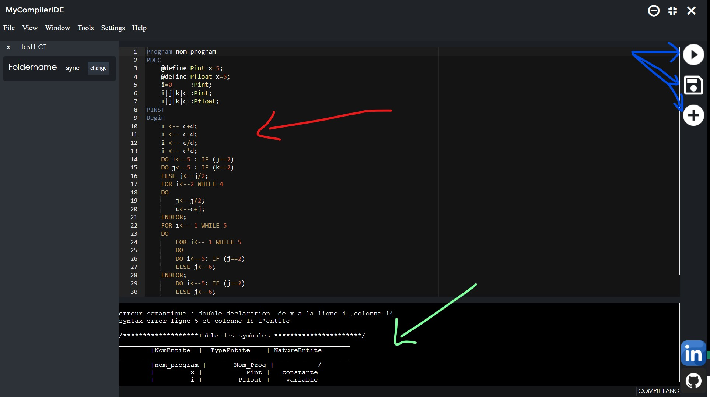

## Preview

To test it you need to install electron 

1. _the red arrow_ is where you can write the code 
2. _the green arrow_ is the results after clicking in the run button in the Top right 
3. _the blue arrows_ are buttoms 
   * **the run buttom** : is to compile the code 
   * **the Save as buttom** : when you want to save the code after writing it 
   * **th Open file buttom** : open an existing file 
  